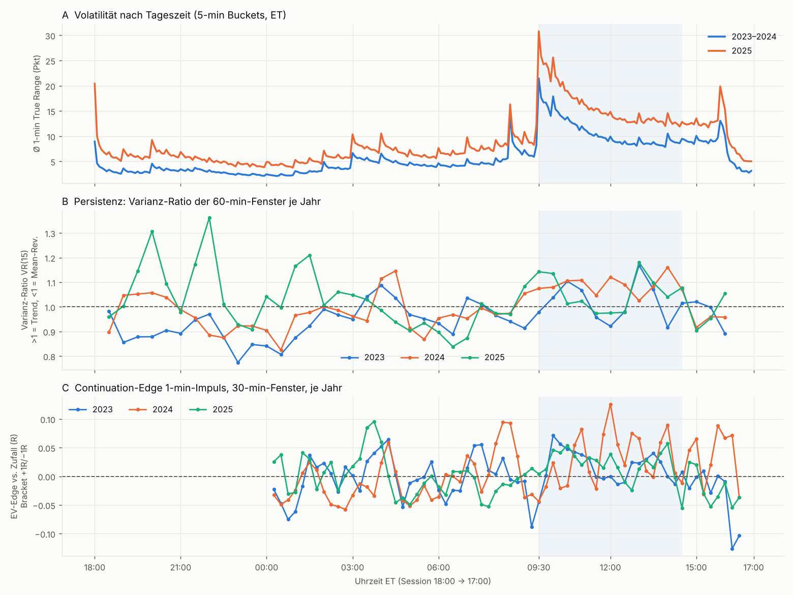
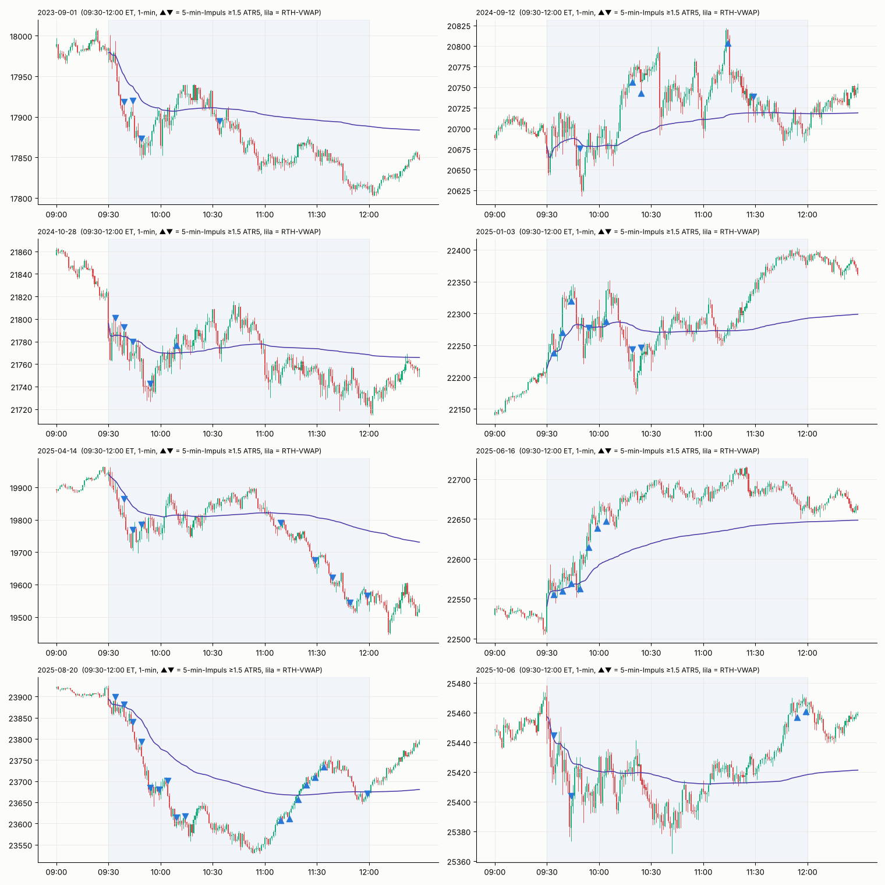
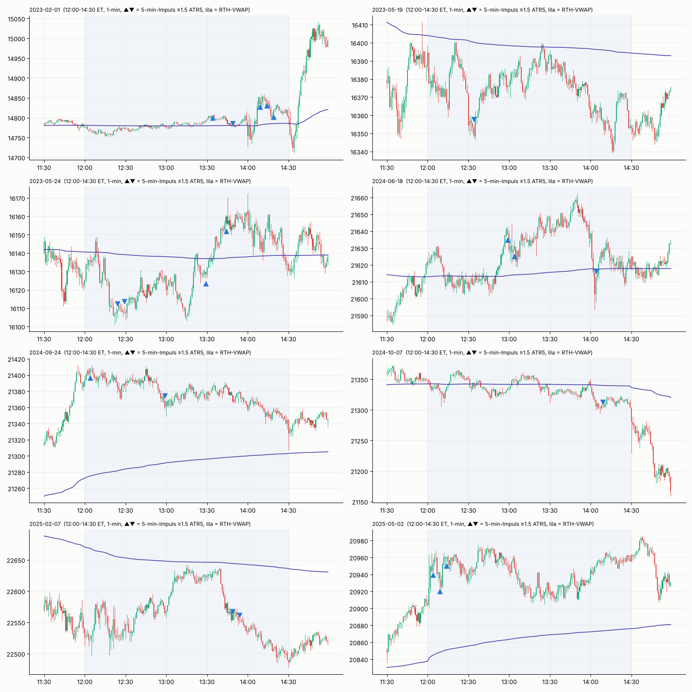
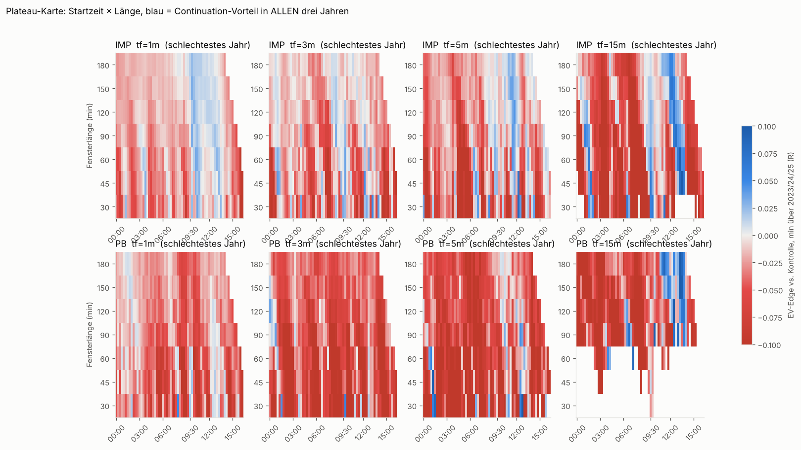
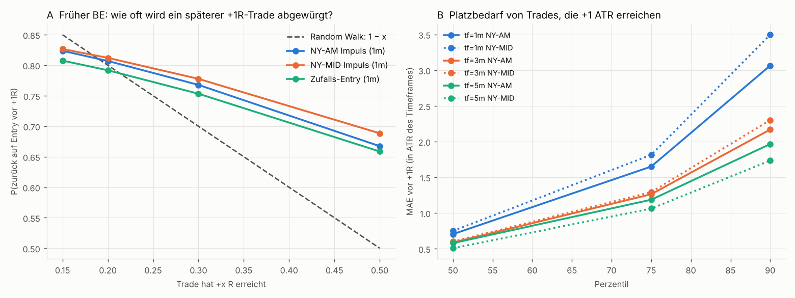

# NQ Continuation Research – Phase 1: Time Windows & Continuation-Verhalten

Datensatz: `Dataset_NQ_1min_2022_2025 (1).csv`, NQ 1-min, 730 saubere Handelstage (Jan 2023 – Dez 2025).
Kein Strategie-Design in dieser Phase, nur Marktverhalten. Alle Skripte liegen in `research/` (Reihenfolge a → l).

---

## 0. Kurzfassung

1. **NQ ist intraday sehr nah an einem Random Walk.** Generische Continuation-Signale (Impuls, Breakout, Pullback-Resumption) liegen meist nur **+0.00 bis +0.06R** über zufälligen Entries im selben Fenster (Bracket +1R/−1R, Stop = 1 ATR des Timeframes). Auf 15-min-Struktur sind es höchstens **+0.08 bis +0.13R**.
2. **Zwei Zeitfenster sind über alle drei Jahre und über benachbarte Fenster hinweg (Plateau) konsistent positiv:**
   - **NY-Vormittag ~09:45–12:15 ET.** Continuation auf 1-min-Mikrostruktur, Persistenz (Varianz-Ratio > 1) in allen Jahren. Die ersten ~15 min nach 09:30 sind für 1-min-Impulse dagegen *schlecht*.
   - **NY-Mittag / Early PM ~12:00–14:30 ET.** Continuation auf 15-min-Struktur (Impuls und Pullback), der stärkste gemessene Edge im Datensatz.
   - Abgelehnt: London/Europa (Peaks ohne Plateau, 2023 teils negativ), Asien 22:00–01:00 (Mean-Reversion), 05:00–06:30 (Mean-Reversion), 14:30–16:00 (negativ).
3. **Continuation zeigt sich bei NQ in der Reichweite, nicht im Tempo.** Direkt nach einem Impuls ist die Chance auf schnelle +0.25R sogar *niedriger* als bei Zufalls-Entries (Volatilitäts-Clustering). Der Vorteil taucht erst bei +1R/+2R auf. Die Kante liegt also im **Runner**, nicht in vielen schnellen Mini-Gewinnen.
4. **Früher BE (+0.15 bis +0.3R) ist mathematisch neutral bis schädlich.** Hat ein Trade +0.2R erreicht, kehrt er in **~80 %** der Fälle zum Entry zurück, bevor er +1R erreicht. Das gilt in allen Fenstern und auf allen Skalen, für Continuation-Events genauso wie für Zufalls-Entries, und entspricht exakt dem Random-Walk-Wert (1 − 0.2). Früher BE erhöht die Trefferquote „nicht verloren“, verwandelt aber genauso viele spätere Gewinner in Scratches.
5. **Kleiner Stop vs. Rauschen:** Auch Trades, die später +1 ATR erreichen, brauchen vorher im 75. Perzentil **~1.0–1.8 ATR** und im 90. Perzentil **2–3.5 ATR** Platz. Ein Stop von ≤ 1 ATR(1m) liegt *im* Rauschen.
6. **Ehrliche Vorab-Einschätzung zum Ziel ≥ +0.35R/Trade:** Mit den gemessenen Rohkanten (≤ ~0.13R im allerbesten, dünn besetzten Fall) halte ich +0.35R/Trade für **sehr wahrscheinlich nicht erreichbar**, ohne zu overfitten. Phase 2 kann das nur mit spezifischeren Setups widerlegen. Ich nehme das Ergebnis nicht vorweg, sage aber jetzt schon, womit zu rechnen ist.

---

## 1. Daten & Methodik (No-Look-Ahead)

| Punkt | Umsetzung |
|---|---|
| Zeitzone | Zeitstempel sind echte US/Eastern inkl. DST (Wartungspause in allen 3 Jahren konstant 17:00–18:00 ET). |
| Bar-Label | CSV-Label = **Bar-Ende** (RTH-VWAP startet beim Label 09:31). Umgerechnet auf **Bar-Start**. Alle Zeiten im Report sind Bar-Start ET. |
| Session | 18:00 ET (Vortag) → 17:00 ET. Halbtage/defekte Sessions entfernt (730 von 763 Tagen bleiben). |
| Signal | Wird auf dem **Close** von Bar t ausgewertet, Entry zum **Open** von Bar t+1. |
| Stop/Target-Ambiguität | Berühren Stop und Target dieselbe Bar, zählt **der Stop zuerst**. Stop-Fill bei Gap zum schlechteren Open. |
| Management-Konvention | Stopp-Anpassungen, die Bar k auslöst, gelten ab Bar k+1 (Bar-Close-Logik wie in Pine). |
| Kein Overnight | Pfade enden am Session-Ende. Nicht aufgelöste Trades werden mark-to-market am letzten Close bewertet. |
| Volatilitätseinheit | ATR(20) des jeweiligen Timeframes, kausal. |
| Kontrolle | **Jede** Bar im selben Fenster, beide Richtungen, gleicher Stop. Der Edge ist immer *Signal minus Kontrolle*, damit Diskretisierung, Tie-Regel und Volatilitätsunterschiede herausfallen. |
| Robustheit | Discovery 2023–2024, Holdout 2025, zusätzlich jedes Jahr einzeln. Ein Fenster zählt nur, wenn **alle 3 Jahre** positiv sind *und* die Nachbarfenster ebenfalls. |

Generische Trigger, bewusst simpel und nicht optimiert:
- **IMP** (Impuls): Netto-Bewegung der letzten 3 Bars ≥ 1.5 ATR, in Richtung des Impulses (auf 1-min zusätzlich 5 Bars ≥ 2 ATR).
- **PB** (Pullback-Resumption): Trend der letzten 10 Bars ≥ 1.5 ATR, Vorbar gegen den Trend, aktuelle Bar schließt über dem Hoch (bzw. unter dem Tief) der Vorbar.
- **BRK** (nur 1-min): Close bricht das 20-Bar-Hoch bzw. -Tief.

> Wichtiger methodischer Befund unterwegs: Eine erste Version maß „P(Ziel vor Stop)“ ohne Mark-to-Market. Dabei entstand ein Scheinedge von +15–20 Pp um 15:30–17:00, weil Impulse bei höherer Volatilität stattfinden und Kontroll-Trades kurz vor Sessionende unaufgelöst bleiben. Der Effekt wurde verworfen. Alle Zahlen unten verwenden die bereinigte EV-Kennzahl.

---

## 2. CHART → OBSERVATION



**A – Volatilität:** Das Profil ist extrem stabil (Korrelation 2023–24 vs. 2025: 0.985). Spitzen liegen bei 08:30 (Daten), 09:30 (Cash Open), 10:00 (Daten), 14:00 (FOMC/Fed-Tage) und 15:50–16:00 (Close). 2025 ist überall ~40–50 % volatiler in Punkten.

**B – Persistenz (Varianz-Ratio VR15 der 60-min-Fenster):** VR > 1 bedeutet Trend, VR < 1 Mean-Reversion. Über **alle drei Jahre > 1** liegen 09:30, 10:00, 10:30, 12:30, 13:00 und 14:00. Konsistent < 1 liegen 22:00–01:00 (Asien), 04:30–06:30 (spätes London) und teilweise 14:30–15:30. Die Momentum-Profile auf **5-min-Bucket-Ebene** sind zwischen den Jahren dagegen unkorreliert (r ≈ 0.0–0.2). Feine Zeitstempel sind Rauschen, nur breite Fenster sind belastbar.

**C – 1-min-Impuls-Edge pro 30-min-Fenster je Jahr:** Die einzige Zone, in der alle drei Jahre überwiegend gemeinsam über null liegen, ist ~09:45–12:00. Am Nachmittag ist 2024 stark, 2023 und 2025 sind gemischt.

**Zufällige Tage (Seed-gezogen, nicht ausgewählt):**




Beobachtungen aus den Charts:
- **NY-AM:** Die ersten 15–45 min setzen oft die Richtung (Opening Drive). 5-min-Impulse treten in **Clustern/Treppen** auf, solange ein Bein läuft (2025-04-14 ab 11:10, 2025-08-20 09:30–10:15, 2025-06-16). Pullbacks innerhalb eines Beins dauern meist nur 1–3 Bars. Sehr häufig folgt **10:00–10:30 ein Retracement Richtung VWAP** (2023-09-01, 2024-10-28, 2025-04-14). Impulse *spät* in einem schon 30–60 min alten Bein markieren oft dessen Ende.
- **1-min-Rauschen:** Selbst in sauberen Beinen gibt es laufend 1-min-Dochte von 1–2 ATR(1m) gegen die Richtung. Das passt zu den MAE-Zahlen in Abschnitt 4.
- **NY-MID:** Ruhiger, oft **Kompression → Ausbruch → Bein von 20–40 min** (2023-05-24 13:30, 2025-02-07 13:45, 2024-06-18 12:55). Daneben gibt es reine Chop-Tage (2023-05-19, 2025-05-02, 2024-09-24), an denen Impulse sofort verpuffen. Fed-Tage (z. B. 2023-02-01 14:00) sind eigene Regime.

---

## 3. Time-Window-Ergebnisse

### 3.1 Bewegung, Noise, Größen (Mittel 2023–2025)

| Fenster (ET) | Median-Range Fenster (Pkt) | Efficiency Ratio | 1-min-Impulse/Tag* | ATR 1m / 5m / 15m (Pkt, 2025) |
|---|---|---|---|---|
| Globex 18:00–19:30 | 39 | 0.114 | 5.0 | – |
| Asien 22:00–00:30 | 32 | 0.079 | 9.0 | – |
| Europa 01:00–04:30 | 67 | 0.071 | 14.3 | 3.8 / 8.6 / 17 (00:45–02:15) |
| London spät 05:00–07:00 | 46 | 0.080 | 7.4 | – |
| Pre-NY 07:00–09:30 | 79 | 0.088 | 9.5 | – |
| **NY open 09:30–11:00** | **144** | **0.117** | 5.6 | 16.4 / 34 / 41 (09:30–12:00) |
| NY late morning 11:00–12:30 | 91 | 0.104 | 4.9 | – |
| **NY early PM 12:30–14:30** | **95** | 0.099 | 6.7 | 10.9 / 26 / 54 (12:00–14:30) |
| NY late PM 14:30–16:00 | 79 | 0.104 | 5.2 | – |

\*IMP mit 5-Bar-Refractory. Efficiency Ratio = |Netto| / Summe |1-min-Moves|; höher heißt weniger Noise pro Punkt Bewegung.

### 3.2 Continuation-Edge vs. Zufall, nach Skala (EV in R, Bracket +1R/−1R, Stop = 1 ATR des TF)

| Skala | Fenster | Trigger | Ø Edge | 2023 | 2024 | 2025 | Trades gesamt |
|---|---|---|---|---|---|---|---|
| 1m | **10:00–12:00** | IMP | **+0.030** | +0.032 | +0.029 | +0.030 | 12 650 |
| 1m | 09:45–12:15 | IMP | +0.036 | +0.031 | +0.040 | +0.037 | 15 697 |
| 1m | 13:00–14:00 | IMP | +0.032 | +0.028 | +0.035 | +0.034 | 6 695 |
| 3m | 09:45–11:45 | IMP | +0.034 | +0.020 | +0.024 | +0.062 | 4 726 |
| 5m | 11:45–13:45 | IMP | +0.076 | +0.127 | +0.042 | +0.061 | 1 998 |
| 15m | **12:30–14:30** | IMP | **+0.112** | +0.103 | +0.157 | +0.068 | 558 |
| 15m | 11:15–14:15 | PB | +0.114 | +0.087 | +0.121 | +0.136 | 401 |
| 15m | 09:30–11:30 | IMP | +0.039 | +0.036 | +0.052 | +0.029 | 2 489 |
| 5m | 01:00–02:00 (EU) | PB | +0.070 | +0.089 | +0.050 | +0.074 | 423 |

**Der Edge wächst mit der Zeitskala** (1m ≈ +0.03R, 5m ≈ +0.05–0.08R, 15m ≈ +0.10R), die Trade-Anzahl fällt aber entsprechend.

### 3.3 Plateau-Test (benachbarte Fenster, Länge 120 min)



*Blau = Edge im **schlechtesten** der drei Jahre noch > 0.*

**1m IMP, Startzeit verschoben:**

| Start | 09:00 | 09:15 | 09:30 | **09:45** | **10:00** | **10:15** | **10:30** | 10:45 | 11:00 |
|---|---|---|---|---|---|---|---|---|---|
| Ø Edge | .002 | .008 | .014 | **.031** | **.030** | **.033** | **.029** | .026 | .024 |
| schlechtestes Jahr | −.011 | −.003 | −.003 | **.018** | **.029** | **.022** | **.015** | .007 | .009 |

→ Stabiles Plateau für Starts 09:45–10:30. Starts *vor* 09:45 verwässern, weil die erste Viertelstunde für 1-min-Impulse schlecht ist.

**15m IMP, Startzeit verschoben:**

| Start | 11:30 | 11:45 | **12:00** | **12:15** | **12:30** | **12:45** | **13:00** | **13:15** | 13:30 |
|---|---|---|---|---|---|---|---|---|---|
| Ø Edge | .001 | .005 | **.082** | **.094** | **.112** | **.112** | **.125** | **.130** | .097 |
| schlechtestes Jahr | −.046 | −.026 | **.048** | **.039** | **.068** | **.038** | **.031** | **.023** | .002 |

→ Plateau für Starts 12:00–13:15. 2025 ist schwächer als 2023/24, aber positiv. Zwischen 11:45 und 12:00 liegt eine scharfe Kante; das ist plausibel, weil die Mittagspause beginnt und der 15-min-Kontext dann von der Vormittags-Session dominiert wird.

**Verworfen:** Europa 5m PB (01:15-Peak: +0.083, aber 2023 nur +0.005, Nachbarn bei 00:15 und 01:45 negativ, also ein Spike ohne Plateau), 3m/5m-IMP mittags (2024 bzw. 2025 ≈ 0 oder negativ) und alles nach 14:30.

### 3.4 Ranking der Zeitfenster

| Rang | Fenster | Warum | Schwäche |
|---|---|---|---|
| 1 | **NY-MID 12:00–14:30** | Größter Edge (15m-Struktur), Plateau, alle Jahre positiv, VR > 1 in allen Jahren, Kompression → Bein im Chart sichtbar | 15m-Signale sind selten (~0.8 IMP/Tag), 2025 schwächer, 15m-ATR ≈ 40–55 Pkt (kein „kleiner Stop“) |
| 2 | **NY-AM 09:45–12:15** | Einziges Fenster mit 1-min-Mikro-Continuation in allen Jahren, breites Plateau, viele Gelegenheiten, höchste Efficiency Ratio | Edge pro Trade sehr klein (+0.03R); 1m-ATR ≈ 11–16 Pkt, Kosten ≈ 0.04–0.06R |
| – | 09:30–09:45 | Volatil, aber für Continuation-Entries auf 1m negativ | – |
| – | Asien, spätes London | Mean-Reversion (VR < 1), für Continuation ungeeignet | – |

---

## 4. Continuation-Verhalten im Detail (was Management ausnutzen kann)

Stop = 1 ATR(tf), Entry auf das nächste Open. „CTRL“ = Zufallsrichtung im selben Fenster.

| | 1m NY-AM IMP | 1m NY-AM CTRL | 5m NY-MID IMP | 5m NY-MID CTRL |
|---|---|---|---|---|
| R in Punkten (Median) | 13.8 | 13.5 | 21.2 | 20.8 |
| P(+0.25R vor −1R) | 0.782 | 0.780 | 0.778 | 0.778 |
| P(+0.5R vor −1R) | 0.672 | 0.662 | 0.670 | 0.658 |
| P(+1R vor −1R) | 0.515 | 0.499 | 0.525 | 0.493 |
| P(+2R vor −1R) | 0.345 | 0.334 | 0.331 | 0.301 |
| Median-Zeit bis +0.5R / +1R / +2R (min) | 1 / 3 / 6 | 1 / 3 / 7 | 5 / 10 / 30 | 5 / 15 / 30 |
| MAE vor +1R (p50 / p75 / p90, in R) | 0.70 / 1.65 / 3.07 | 0.73 / 1.70 / 3.10 | 0.51 / 1.06 / 1.73 | 0.52 / 1.06 / 1.71 |
| **P(BE vor +1R \| +0.2R erreicht)** | **0.81** | 0.79 | **0.81** | 0.79 |
| P(BE vor +1R \| +0.3R erreicht) | 0.77 | 0.75 | 0.76 | 0.74 |

(Vollständige Tabelle für alle Fenster und Skalen: `output/J_behavior.csv`.)



**Erkenntnisse:**
1. **Tempo:** Kleine Ziele (+0.25/+0.5R) werden in der ersten Bar erreicht oder gar nicht, und zwar bei Signal und Zufall gleichermaßen. Schnelligkeit ist eine Eigenschaft der Bar-Auflösung, nicht des Setups.
2. **Asymmetrie:** Der Vorteil des Signals steigt mit der Zielweite: +0.25R ≈ 0, +1R ≈ +1.5–3 Pp, +2R ≈ +1–3 Pp. Direkt nach einem Impuls sind schnelle +0.25R-Gewinne auf 3m/5m sogar etwas *seltener* als bei Zufall (siehe `J_behavior.csv`, NY-AM 3m: 0.694 vs. 0.734). Ursache ist Volatilitäts-Clustering: Nach einem Impuls ist auch der Gegenausschlag größer.
3. **BE-Frage:** Ein BE bei +0.15 bis +0.3R wird in ~75–85 % der Fälle ausgelöst, bevor der Trade +1R erreicht. Bei Bar-Close-Management auf 1-min-Bars ist es sogar etwas *schlechter* als im Random Walk, weil eine 1-min-Kerze ≈ 1R breit ist. Management-Stufen in R-Bruchteilen von 0.05–0.2 liegen **unter der Auflösung des 1-min-Bars**, wenn R ≈ 1 ATR(1m) ist.
4. **Platzbedarf:** Gute Trades (später +1R) brauchen vorher im 75. Perzentil ~1.1–1.8 R und im 90. Perzentil 1.7–3.5 R Luft, gemessen in ATR des jeweiligen Timeframes. Je feiner der Timeframe, desto mehr Platz relativ zur ATR.
5. **Kosten:** 0.6 Pkt Roundtrip (Kommission plus ~1 Tick Slippage) entsprechen bei einem 1-ATR(1m)-Stop **0.04R (NY-AM) bzw. 0.055R (NY-MID)**. Das ist mehr als der gesamte 1-min-Edge. Bei 5m/15m-Stops sind es 0.01–0.02R.

---

## 5. Konsequenzen für das Strategie-Design (Phase 2)

Was die Daten über deine Prioritäten sagen:

| Wunsch | Befund |
|---|---|
| Kleiner Initial-Stop | Ein Stop ≤ 1 ATR(1m) (~11–16 Pkt NY-AM, ~8–11 Pkt NY-MID) liegt im Rauschen, und die Kosten fressen den Edge. Ein *strukturell* kleiner Stop (Pullback-Low auf 3–5m, typ. 15–30 Pkt) ist der realistische Kompromiss. |
| Hohe Winrate | Ist durch kleine Ziele oder frühes BE trivial erreichbar, erzeugt aber **keine** Expectancy (Optional-Stopping-Theorem, empirisch bestätigt: P(BE vor +1R \| +x) ≈ 1 − x). Eine hohe WR ist hier kein Qualitätsmerkmal. |
| Frühes BE | BE bei +0.15–0.3R verwandelt ~80 % der späteren Gewinner in Scratches. Hilfreich höchstens zur Reduktion der Verlust-Streaks (Psychologie, Tageslimit), nicht für die Expectancy. |
| Aggressives Trailing | Da der Continuation-Edge im **Tail** liegt (Runner), schneidet ein enges Trailing genau den Teil ab, der den Edge trägt. Zu testen ist es trotzdem (Phase 2), aber die Erwartung ist ehrlich gesagt negativ. |
| ≥ +0.35R/Trade | Die gemessenen Rohkanten liegen bei +0.03 bis +0.13R. Management kann bei einem Prozess nahe am Random Walk keine Expectancy *erzeugen*, nur umverteilen. Ohne deutlich stärkere, spezifischere Setups ist das Ziel unrealistisch. |
| Tageslimit ±1R | Funktioniert technisch mit jeder Variante; es ändert die Verteilung der Tage, aber nicht das Vorzeichen der Expectancy. |

### Hypothesen für Phase 2 (einfach, programmierbar, aus den Beobachtungen abgeleitet)

- **H1 – NY-MID 15m-Impuls → 1m/3m-Pullback-Entry (12:00–14:30):** 15-min-Impuls (≥ 1.5 ATR15 über 3 Bars) definiert die Richtung. Entry erst nach einem flachen Pullback auf 1–3m mit Stop am Pullback-Extrem. Ziel: den 15m-Edge mit einem kleineren, strukturellen Stop handeln.
- **H2 – NY-AM Impuls-Cluster (09:45–12:15):** Nur der *zweite* 5m-Impuls in dieselbe Richtung innerhalb von 30 min (Treppe, siehe Charts), Entry nach 1–2-Bar-Pullback. Nicht im ersten 15-min-Block handeln.
- **H3 – NY-MID Kompression → Expansion:** Range-Kontraktion (z. B. 30-min-Range < x × ATR15), dann Ausbruchs-Bar ≥ 1.5 ATR5, Entry am Retest.
- Jede Hypothese wird zuerst *ohne* Management (fester Bracket) auf Edge vs. Kontrolle getestet. Erst wenn der Rohedge trägt, kommen BE- und Trailing-Varianten sowie das Tageslimit dazu. Danach folgen OOS (2025) und Walk-Forward.

---

## 6. Reproduzieren

```
cd research
python3 prep.py           # Datenaufbereitung (Cache in output/)
python3 a_profile.py      # 24h-Profil
python3 b_events.py       # Events + Kontrolle (1m)
python3 c_windows.py      # Fenster-Scan 1m
python3 d_blocks.py       # Varianz-Ratio, Block-Momentum
python3 e_fine.py && python3 f_map.py
python3 g_candidates.py   # Kandidaten-Vergleich, Noise
python3 h_scale.py        # Skalen-Vergleich
python3 i_scale_grid.py   # Plateau-Grid (EV-Kennzahl)
python3 j_behavior.py     # Tempo / MAE / MFE / BE
python3 k_charts.py && python3 l_candles.py 09:30-12:00 7 && python3 l_candles.py 12:00-14:30 11
```
Benötigt: Python 3, pandas, numpy, matplotlib.
