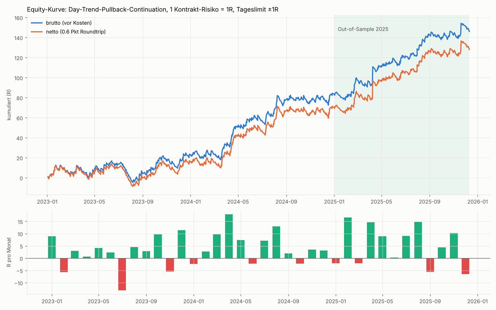
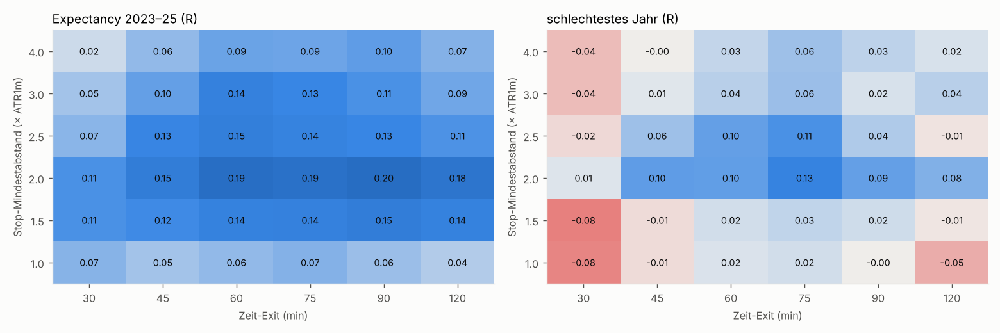
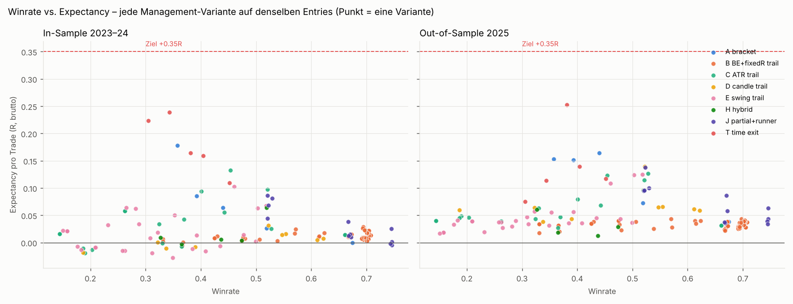

# NQ Continuation Research – Phase 2: Setups, Management, Validierung

Aufbauend auf Phase 1 (`REPORT_Phase1_TimeWindows.md`). Daten: NQ 1-min, 730 saubere Handelstage 2023–2025.
Code: `research/p2/`, Pine: `research/pine/NQ_DayTrend_Pullback_Continuation.pine`.

---

## 0. Ergebnis in einem Absatz

**Das Ziel von ≥ +0.35R pro Trade wird nicht robust erreicht.** Der beste Kandidat, der alle Robustheitstests besteht, liegt bei **+0.19R brutto bzw. +0.17R netto pro Trade**. Das sind +0.25R im Out-of-Sample-Jahr 2025 und +0.21R im Walk-Forward 2024–25, bei ~1 Trade pro Tag. Der Kandidat ist Continuation-only, jedes Jahr positiv und frei von Look-Ahead (Truncation-Test).

Er widerspricht aber deinen Prioritäten 2–5: Der Stop ist nicht klein (Median ~29 Pkt), die Winrate ist niedrig (38 %), es gibt **kein** frühes BE und **kein** Trailing. In allen 150+ getesteten Management-Varianten liefern frühes BE (+0.15 bis +0.4R) und aggressives Trailing zwar 60–75 % Winrate, aber eine Expectancy von **≈ 0R** (netto negativ). Das passt zu Phase 1: Der Continuation-Vorteil bei NQ steckt im Weiterlaufen über 30–60 min, nicht in schnellen kleinen Gewinnen.

---

## 1. Marktbeobachtung → Hypothesen (CHART → OBSERVATION → HYPOTHESIS)

Aus Phase 1 (Charts und Statistik):
- Continuation ist bei NQ **langsam und klein**: Nach Continuation-Signalen folgt eine Drift von ~3–6 Pkt in 30–60 min, auf 1-min-Ebene herrscht nahezu Random Walk.
- Ein Stop ≤ 1–1.5 ATR(1m) liegt **im Rauschen**.
- Ein BE bei +0.2R wird in ~80 % der Fälle vor +1R ausgelöst (Random-Walk-Mathematik).
- Robuste Fenster: NY-Vormittag (~09:45–12:15) und NY-Mittag (~12:00–14:30).
- In den Charts sichtbar: Impuls-Treppen (Cluster), flache 1–3-Bar-Pullbacks in laufenden Beinen und mittags Kompression → Ausbruch → Bein von 20–40 min.

Getestete Hypothesen (alle mit derselben programmierbaren Entry-Maschine, siehe 3.):

| | Hypothese | Fenster |
|---|---|---|
| H1 | 15m-Impuls → 1m-Pullback-Resumption | MID (und AM als Gegenprobe) |
| H2 | **zweiter** 5m-Impuls in dieselbe Richtung binnen 30 min (Cluster) → 1m-Pullback | AM und MID |
| H3 | 5m-Kompression (30 min) → Ausbruchsbar → 1m-Pullback | MID (und AM als Gegenprobe) |

## 2. Backtest-Schritte und was sie gezeigt haben

**2.1 Roher Vorteil mit kleinem strukturellem Stop** (Pullback-Low − 1 Tick, Median 12–19 Pkt ≈ 1.3 ATR1m), fester Bracket, kein Management, verglichen mit einer Kontrollgruppe (dieselbe Entry-Maschine, zufällig ausgelöst):

| Setup | Trades/Tag | EV +1R/−1R | EV +2R/−1R | Kontrolle +1R/−1R |
|---|---|---|---|---|
| H1 MID | 0.90 | −0.041 | −0.042 | −0.032 |
| H2 AM | 2.03 | −0.008 | +0.023 | −0.010 |
| H2c MID | 1.08 | +0.042 | −0.011 | +0.019 |
| H3 MID | 1.85 | +0.043 | +0.070 | +0.008 |
| H3b AM | 1.33 | −0.031 | −0.052 | +0.001 |

→ **Mit kleinem Stop hat kein Setup einen relevanten Vorteil.** Das bestätigt Phase 1.

**2.2 Drift in Punkten, unabhängig vom Stop.** Mittlere Bewegung in Trade-Richtung 30 min nach dem Entry:

| Setup (Pullback-Entry) | Drift 30 min (Pkt) | in ATR1m | 2023 | 2024 | 2025 | t |
|---|---|---|---|---|---|---|
| **H3 MID** | **+3.5** | **+0.31** | +0.29 | +0.34 | +0.30 | 3.1 |
| H1 MID | +4.1 | +0.36 | +0.35 | +0.61 | +0.05 | 2.6 |
| H2 AM (cluster) | +1.1 | +0.08 | −0.11 | +0.23 | +0.13 | 1.0 |
| Kontrolle (Zufall) | ±0 | ≈ 0 | | | | |

Die Bracket-EV von H3 ist für **jede** Stop-Größe von 1 bis 6 ATR1m positiv (+0.03 bis +0.12R). Das ist ein Plateau, kein Einzelwert.

**2.3 Ein logischer Kontextfilter: Tagesrichtung.** Gehandelt wird nur in Richtung „Kurs vs. 09:30-Open“, also Continuation des Tagesbeins. Das ist der einzige Filter, der eingeführt wurde (getestet: VWAP-Seite, Tagesrichtung, 60-min-Trend). Er verbessert H3 in jedem Jahr, und die Gegenseite (gegen die Tagesrichtung) ist schon in den IS-Jahren 2023/24 schwach bis negativ. Eine Einschränkung zur Transparenz: Die Jahreszahlen inklusive 2025 waren bei dieser Wahl sichtbar.

**2.4 Management-Grid** (8 Familien A–J aus deiner Liste, 150+ Varianten, Auswahl nur auf 2023–24): Siehe Abschnitt 8. Das Ergebnis ist eindeutig: **Je früher eingegriffen wird, desto näher liegt die Expectancy bei 0.**

**2.5 Kontrolle gegen „einfach mittags in Tagesrichtung handeln“:** Zufällige Entries in Tagesrichtung mit identischem Stop und Exit kommen auf +0.03 bis +0.07R, das Setup auf +0.23 bis +0.40R (IS). **Das Setup selbst liefert also echten Mehrwert.**

**2.6 Generalisierung:** Mit derselben Logik (Tagesrichtung, Stop ≥ 2 ATR1m, Zeit-Exit) sind auch H2 am Vormittag und H2 am Mittag in allen Jahren positiv. Daraus entsteht das finale **Zwei-Fenster-System** mit ~1 Trade pro Tag statt 0.7.

---

## 3. Die Strategie: „NQ Day-Trend Pullback Continuation“

### 3.1 Warum dieses Zeitfenster?
Phase 1 zeigte für 09:45–12:15 und 12:00–14:30 ET als einzige Bereiche Continuation-Persistenz (Varianz-Ratio > 1) **und** einen positiven Signal-Edge in allen drei Jahren, jeweils mit Plateau über benachbarte Fenster. Die erste Viertelstunde nach 09:30 ist für Continuation-Entries negativ und wird deshalb ausgelassen.

### 3.2 Warum Continuation in diesen Fenstern?
Vormittags setzen sich Bewegungen in Treppen fort (5m-Impuls-Cluster). Mittags laufen Ausbrüche aus 30-min-Kompressionen in Tagesrichtung typischerweise 20–40 min weiter. Messbar ist das als positive 30-min-Drift nach dem Signal.

### 3.3 Exakte Entry-Regeln (alle Zeiten Bar-Start ET, 1-min-Chart)
1. **5-min-Bars** aus 1-min-Bars, Blöcke ab 18:00 ET ausgerichtet. Ein 5m-Bar ist erst nach Schluss seiner letzten Minute bekannt. ATR5 = SMA(20) der 5m-True-Range, ATR1m = SMA(20) der 1m-True-Range.
2. **Arm-Ereignisse** (bei 5m-Bar-Schluss, aktiv ab der nächsten 1m-Bar):
   - **AM_H2** (5m-Bar endet 09:45–12:00) und **MID_H2** (endet 12:00–14:15): `close5 − close5[3] ≥ +1.5·ATR5` (long) bzw. `≤ −1.5·ATR5` (short), innerhalb derselben Session, der 5m-Bar enthält ≥ 4 Minuten, **und** einer der 6 vorherigen 5m-Bars derselben Session war ein Impuls in dieselbe Richtung. Impuls-Box = Hoch/Tief der letzten 3 5m-Bars, Impulsgröße = |Bewegung|. Gültig für 20 1m-Bars.
   - **MID_H3** (endet 12:00–14:15): Range der 6 vorherigen 5m-Bars ≤ 2.5·ATR5 (alle in derselben Session). Der aktuelle 5m-Bar schließt über deren Hoch (long) bzw. unter deren Tief (short), und seine eigene Range ist ≥ 1.0·ATR5. Gültig für 30 1m-Bars.
3. **Entry-Maschine je Arm** (long; short gespiegelt): `run` = Impuls-Hoch und jedes neue Hoch danach. Jede 1m-Bar ohne neues Hoch ist eine Pullback-Bar, das Pullback-Tief wird mitgeführt.
   - **Trigger** bei Close einer 1m-Bar: ≥ 1 Pullback-Bar **und** (run − Pullback-Tief) ≥ 0.5·ATR1m der Vorbar **und** `close > high[1]`.
   - **Ungültig**, wenn der Pullback tiefer als 60 % der Impulsgröße wird oder der Arm abläuft. Pro Arm gibt es höchstens einen Trigger.
4. **Filter:** Die Entry-Bar liegt im Modulfenster (AM: 09:45–12:15, MID: 12:00–14:30), und die Richtung entspricht dem Vorzeichen von (Close − heutiges 09:30-Open).
5. **Entry:** Market zum **Open der nächsten 1m-Bar**. Triggern mehrere Arme gleichzeitig, gilt die Priorität AM_H2 > MID_H2 > MID_H3, danach der früheste Arm. Es gibt immer nur eine Position gleichzeitig.

### 3.4 Exakter Initial Stop
Long: `min(Pullback-Tief − 1 Tick, Signal-Close − 2.0·ATR1m)`, auf Tick abgerundet (short gespiegelt, aufgerundet). Der Stop sitzt also an der Struktur, aber **nie näher als 2 ATR1m**, weil Phase 1 zeigte, dass guter Continuation-Trades so viel Luft brauchen. Median-Stop: 29 Pkt (2023: 25, 2024: 28, 2025: 36), also ~1.0–1.3 ATR5.

### 3.5 BE-Regel
**Keine.** Jede getestete BE-Regel zwischen +0.15R und +1.5R senkt die Expectancy (Tabelle in Abschnitt 8). Im Pine Script ist BE als optionaler Input vorhanden (Default aus).

### 3.6 Trailing-Regel
**Keine.** Alle Trailing-Familien (fixed-R, ATR, Candle, Swing, Chandelier-artig, Hybrid, Partial+Runner) liegen unter dem reinen Zeit-Exit. Fixed-R-Trailing ist im Pine Script optional verfügbar (Default aus).

### 3.7 Exit-Regel
Der Initial-Stop bleibt unverändert. Zusätzlich gibt es einen **Zeit-Exit**: nach 60 1m-Bars im Trade (inklusive Entry-Bar) oder spätestens an der Bar ab 15:54 ET. Die Exit-Order wird beim Bar-Schluss gesendet und zum nächsten Open gefüllt. Stops werden konservativ behandelt: Gap = Fill zum schlechteren Open.

### 3.8 Tagesregel ±1R
Erreicht die realisierte Tages-Summe ≥ +1R oder ≤ −1R, werden keine neuen Trades eröffnet. Ein offener Trade läuft regulär zu Ende (auch über +1R hinaus; der beste Tag lag bei +18R). **Folge:** Da ein Verlierer ≈ −1R kostet, beendet fast jeder erste Verlust den Tag.

---

## 4. Performance (brutto vor Kosten; netto = 0.6 Pkt Roundtrip)



| Kennzahl | 2023–25 | IS 2023–24 | **OOS 2025** | 2023 | 2024 |
|---|---|---|---|---|---|
| Trades | 755 | 507 | 248 | 245 | 262 |
| Trades/Tag · /Woche · /Monat | 1.03 · 5.2 · 21.7 | 1.02 | 1.06 | 1.00 | 1.05 |
| Winrate | 38.1 % | 36.5 % | 41.5 % | 36.3 % | 36.6 % |
| Ø Gewinn / Ø Verlust (R) | +2.06 / −0.96 | +2.13 / −0.97 | +1.94 / −0.95 | +1.98 / −0.99 | +2.26 / −0.95 |
| **Expectancy (R)** | **+0.193** | +0.165 | **+0.253** | +0.096 | +0.228 |
| Expectancy netto (R) | +0.170 | +0.139 | +0.233 | +0.069 | +0.204 |
| Profit Factor | 1.33 | 1.27 | 1.46 | 1.16 | 1.38 |
| Max Drawdown (R) | 21.5 | 21.5 | 9.1 | 21.5 | 10.1 |
| Max Verlustserie (Trades) | 11 | 11 | 9 | 7 | 11 |
| Ø / Median Dauer (min) | 36 / 38 | 35 / 34 | 37 / 50 | 34 / 28 | 36 / 38 |
| MAE Median / p75 (R) | 1.02 / 1.14 | | | | |
| MFE Median / p75 (R) | 1.10 / 2.37 | | | | |
| Long-Exp. (n) | +0.246 (397) | +0.211 | +0.316 | +0.207 | +0.215 |
| Short-Exp. (n) | +0.135 (358) | +0.114 | +0.180 | **−0.024** | +0.242 |

**Tagesstatistik (Tageslimit aktiv):**

| | 2023–25 | 2025 |
|---|---|---|
| Positive / negative / flache Tage | 33.6 % / 59.9 % / 6.6 % | 35.7 % / 57.0 % / 7.2 % |
| Tage mit +1R erreicht / −1R erreicht | 29.2 % / 56.3 % | 30.2 % / 53.2 % |
| Ø Tages-P&L | +0.20R | +0.27R |
| **Median Tages-P&L** | **−1.0R** | −1.0R |
| Max Tagesverlust / -gewinn | −1.94R / +18.1R | |
| Max Verlust-Tage in Folge / Gewinn-Tage in Folge | **21** (2023) / 7 | 6 / 5 |
| Ø Trades bis +1R erreicht | 1.14 | |
| Tage mit 0 / 1 / 2+ Trades | 6.6 % / 84.7 % / 8.8 % | |
| Positive Monate | 72 % (schlechtester −13R, bester +18R) | |
| Quartale positiv | 11 von 12 (2023-Q3 −0.08R) | |

Module: AM_H2 526 Trades +0.195R, MID_H3 176 Trades +0.069R, MID_H2 53 Trades +0.596R. Im Verbund bekommt MID_H3 oft keinen Trade mehr, weil der Tag nach einem AM-Verlust gesperrt ist; alleine gehandelt liegt MID_H3 bei +0.245R.

## 5. Out-of-Sample
2025 wurde für keine Parameterwahl als Kriterium benutzt (Ausnahme: Transparenzhinweis zum Tagesrichtungs-Filter, 2.3). OOS 2025: **+0.253R/Trade**, WR 41.5 %, PF 1.46, Max DD 9.1R, alle vier Quartale positiv.

## 6. Walk-Forward
Verankertes Walk-Forward des **gesamten Auswahlprozesses**: Aus Stop-Abstand {1.5, 2, 2.5, 3} × Management {Zeit-Exit 45/60/90/120, aggressives BE, BE@1.5R, Partial, Swing-Trail} wird je Quartal die beste Konfiguration auf allen Daten davor gewählt und im folgenden Quartal gehandelt (8 Testquartale 2024–25).

| Quartal | 24Q1 | 24Q2 | 24Q3 | 24Q4 | 25Q1 | 25Q2 | 25Q3 | 25Q4 |
|---|---|---|---|---|---|---|---|---|
| gewählt | 2.0/t120 | 2.0/t120 | 2.0/t120 | 2.0/t120 | 2.0/t90 | 2.0/t90 | 2.0/t90 | 2.0/t90 |
| Test-Exp. (R) | +0.05 | +0.46 | +0.40 | +0.29 | −0.06 | +0.29 | +0.13 | +0.08 |

**Walk-Forward gesamt: 487 Trades, +0.209R brutto / +0.187R netto, WR 34 %, PF 1.33, Max DD 17R.** Der Prozess wählt nie BE oder Trailing.

## 7. Robustheit



- **Zeitfenster-Plateau:** AM-Start 09:30/09:45/10:00 × MID-Start 11:45/12:00/12:15 × vier Fensterlängen ergeben **36 von 36 Kombinationen mit positiver Expectancy (+0.18 bis +0.27R)**, und jedes Jahr ist positiv (`output/p2_plateau_windows.csv`).
- **Setup-Parameter** (H3, Kompression 2.0–3.0, Lookback 4–8, Breakout 0.8–1.2, Pullback-Tiefe 0.3–0.8, Retracement 0.4–0.8, Zeit-Exit 60): im Schnitt alle positiv (IS +0.13 bis +0.38R, 2025 +0.12 bis +0.46R). Bei lockerer Kompression (3.0 bzw. Lookback 4) ist 2023 leicht negativ (−0.01 / −0.05R). Straffere Kompression (2.0 / Lookback 8) wäre besser, wurde aber bewusst **nicht** nachträglich gewählt (`output/p2_robust.csv`).
- **Stop-Abstand × Zeit-Exit:** Die Expectancy ist für alle Abstände von 1.0 bis 4.0 ATR1m und Haltedauern von 30 bis 120 min positiv. **Aber:** Im *schlechtesten Jahr* ist 2.0 ATR spürbar besser als 1.5 und 3.0. 2.0 liegt also eher auf einem Grat als auf einem breiten Plateau. **Overfitting-Verdacht in abgeschwächter Form**, siehe Schwächen.
- **Kosten:** Pro 0.5 Pkt Roundtrip sinkt die Expectancy um ~0.02R (0 Pkt: +0.193, 1 Pkt: +0.154, 2 Pkt: +0.114).
- **Look-Ahead-Test:** Daten an 6 zufälligen Zeitpunkten abgeschnitten, alle Signale davor identisch → keine Zukunftsinformation.
- **Simulator-Verifikation:** unabhängige Referenzimplementierung, 7 Management-Varianten, 0 Abweichungen.

## 8. Management-Vergleich: deine Wunsch-Logik vs. Daten



Alle Varianten laufen auf denselben Entries mit Tageslimit (Expectancy brutto):

| Variante | Trades/Tag | Winrate | Exp. IS | Exp. OOS 2025 | netto (alle) |
|---|---|---|---|---|---|
| **BE +0.2R(+0.05) → Trail 0.25R ab +0.3R** | 2.49 | 69 % | +0.006 | +0.030 | −0.013 |
| BE +0.15R → Trail 0.25R | 2.61 | 48 % | +0.008 | +0.023 | −0.014 |
| BE +0.3R(+0.1) → Trail 0.25R ab +0.5R | 2.23 | 70 % | +0.008 | +0.036 | −0.010 |
| Hybrid +0.2 BE / +0.4 Trail 0.4 / +0.6 Trail 0.25 | 2.42 | 44 % | +0.005 | +0.012 | −0.019 |
| Partial 50 % @ +0.3R + Runner BE | 2.05 | **75 %** | +0.026 | +0.034 | +0.002 |
| Fixer Bracket +0.5R / −1R | 1.65 | 67 % | −0.001 | +0.038 | −0.013 |
| Beste Trailing-Variante (ATR 3× ab +1R) | 1.19 | 45 % | +0.133 | +0.123 | +0.105 |
| Beste Partial-Variante (50 % @ +1R, Rest BE) | 1.20 | 52 % | +0.087 | +0.095 | +0.065 |
| **Kandidat: kein Management, Zeit-Exit 60 min** | 1.03 | 38 % | **+0.165** | **+0.253** | **+0.170** |

**Erklärung:** Die Drift nach dem Signal ist klein (wenige Punkte) und baut sich über 30–60 min auf. Jeder frühe BE- oder Trail-Stop schließt den Trade im normalen Rauschen. Das erzeugt viele kleine Gewinne und Scratches, aber zugleich verschwindet genau der Teil der Trades, der den Vorteil trägt. „Kleine Verluste + viele kleine Gewinne“ ist mit diesem Markt und diesen Daten mathematisch nicht profitabel.

## 9. Schwächen / Failure Modes

1. **Ziel verfehlt:** +0.19R (OOS +0.25R, WF +0.21R) statt ≥ +0.35R.
2. **Niedrige Winrate (38 %) und binäre Tage:** 56 % aller Tage enden bei −1R, der Median-Tag ist −1R. Der Gewinn kommt von 29 % der Tage mit Runnern bis +18R. Das ist das Gegenteil des gewünschten Profils und psychologisch hart.
3. **Lange Durststrecken:** 21 Verlust-Tage in Folge (2023), 2023-Q3 negativ, Max DD 21R.
4. **Regimeabhängigkeit:** 2023 nur +0.10R (Shorts −0.02R), 2024/2025 deutlich stärker. Die Strategie lebt von Tagen mit klarer Richtung.
5. **Stop-Abstand 2.0 ATR1m** ist eher ein Grat als ein breites Plateau (siehe 7).
6. **Stop in Punkten nicht klein:** Median 29 Pkt (~$580 je NQ, ~$58 je MNQ).
7. **Frequenz:** ~1.0 statt 2+ Trades/Tag. Mehr Trades gibt es nur mit Varianten, die keinen Vorteil haben.
8. **Datenbasis:** nur 3 Jahre, keine echte Ungesehen-Periode mehr übrig. Halbtage wurden im Research ausgeschlossen, Pine handelt sie mit.

## 10. Pine Script

`research/pine/NQ_DayTrend_Pullback_Continuation.pine` (Pine v6, **1-min-Chart NQ**). Es enthält dieselben Regeln in derselben Reihenfolge wie `p2/sim.py`:
- 5m-Bars werden intern aus 1m gebaut, das vermeidet Look-Ahead über `request.security`.
- Entry zum nächsten Open, Stop-Mindestabstand vom Signal-Close.
- Zeit-Exits als Market-Order zum nächsten Open, Tageslimit über realisierte R.
- BE und Trailing als optionale Inputs (Default aus).

**Abgleich:** Die Research-Trade-Liste steht in `output/p2_final_trade_list.csv` (Entry-/Exit-Zeit ET, Richtung, Stop, R). Bekannte Abweichungen: Halbtage, begrenzte 1m-Historie in TradingView, sehr seltene fehlende Minuten am 5m-Blockende. **Hinweis:** Das Script konnte hier nicht in TradingView kompiliert werden. Bitte einmal laden und bei Compiler-Meldungen kurz Bescheid geben.

## 11. Reproduzieren
```
cd research/p2
python3 raw_test.py         # 2.1 roher Edge
python3 drift_test.py       # 2.2 Drift & Stop-Größe
python3 filter_test.py      # 2.3 Kontextfilter
python3 grid.py H3          # 2.4 Management-Grid (IS)
python3 control_daydir.py   # 2.5 Kontrolle Tagesrichtung
python3 robust.py; python3 moderate.py; python3 addons.py; python3 system.py
python3 verify_sim.py       # Simulator-Verifikation
python3 lookahead_test.py   # Look-Ahead-Test
python3 final_eval.py       # Endauswertung + Walk-Forward + Plateau
python3 charts_p2.py
```
